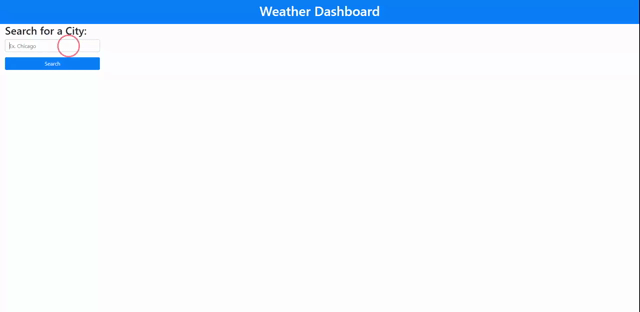

# Weather-Dashboard

[Live Link](https://jbrendon15.github.io/Weather-Dashboard/)

## Description
For this project we had to create a webpage that fetches data from an API so we can use that information and display it on the webpage. We used the OpenWeather API to display the current day's weather in the user inputted location and a five day forecast for the location. We had to save previous searches, dynamically create buttons and add them to the webpage so users can easily recheck locations that they searched before. We also learned about event delegation so that we can add the event listener to the parent tag of the buttons we created to make the buttons functional. We did not include the UV Index in the webpage because the free of the API did not give that information to us, so our instructor told us to leave it out. We also had to change the API url we use to fetch data because the longitude and latitude format was not working so our instructor told us to use city name to fetch.

## Usage

